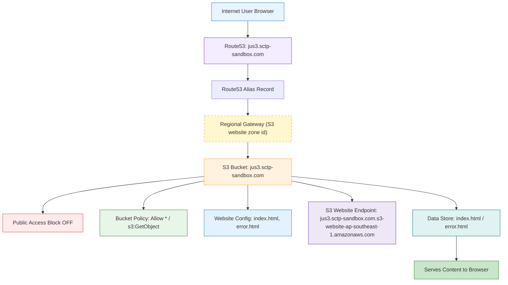

# S3 Static Website Hosting Module

Industry-standard Terraform module for hosting static websites on AWS S3 with proper public access configuration.

## Features

- ✅ S3 bucket with static website hosting configuration
- ✅ Public Access Block controls (configurable)
- ✅ Public bucket policy for read-only access
- ✅ Server-side encryption (AES256 or KMS)
- ✅ Bucket versioning for disaster recovery
- ✅ Object ownership controls (BucketOwnerEnforced)
- ✅ Proper IAM and security best practices
- ✅ Tag management

## Module Structure

```
.
├── main.tf                          # Root module configuration
├── variables.tf                     # Root module variables
├── outputs.tf                       # Root module outputs
├── terraform.tfvars.example         # Example configuration
├── README.md                        # This file
└── modules/
    ├── s3_static_website/           # Reusable S3 module
    │   ├── main.tf                  # S3 resource definitions
    │   ├── variables.tf             # Module input variables
    │   └── outputs.tf               # Module outputs
    └── route53/                     # Optional DNS record module
        ├── main.tf                  # Route53 record definition
        ├── variables.tf             # Module input variables
        └── outputs.tf               # Module outputs
```

## Usage

### 1. Create a terraform.tfvars file

Copy the example and customize:

```bash
cp terraform.tfvars.example terraform.tfvars
```

Edit `terraform.tfvars` with your values:

```hcl
aws_region   = "us-east-1"
project_name = "my-website"
environment  = "prod"
bucket_name  = "my-unique-bucket-name"

# Allow public access for website
block_public_acls       = false
block_public_policy     = false
ignore_public_acls      = false
restrict_public_buckets = false
```

### 2. Initialize Terraform

```bash
terraform init
```

### 3. Review planned changes

```bash
terraform plan -var-file="terraform.tfvars"
```

### 4. Apply configuration

```bash
terraform apply -auo-approve -var-file="terraform.tfvars"
```

### 5. Upload website files

```bash
aws s3 cp index.html s3://my-unique-bucket-name/
aws s3 cp error.html s3://my-unique-bucket-name/
aws s3 sync ./public s3://my-unique-bucket-name/
```

## Optional: Route53 DNS record

This repo includes a small `route53` module to create a DNS record pointing at your S3 website endpoint.

To enable it, set the following in `terraform.tfvars`:

```hcl
# Option A: provide hosted zone ID (recommended if you already have it)
route53_zone_id       = "Z123456ABCDEFG"           # Your local hosted zone ID, which you own
route53_record_name   = "www.example.com"          # The record to create
route53_create_alias  = true                       # this is a switch in the code

# Option A+: omit alias zone ID and let the module derive it from the AWS region
# (works for S3 website endpoints, and uses the region-per-hosted-zone mapping)
route53_alias_zone_id = ""

# Option B: provide zone name to look up the zone ID automatically
# route53_zone_name = "example.com"
```

For `ap-southeast-1`, the correct S3 website endpoint hosted zone ID is `Z1LMS91P8CMLE5`.
## IMPORTANT: These are hosted zone IDs for S3 WEBSITE endpoints (not S3 REST API endpoints)
S3 website endpoints use different alias one IDs than regular S3 endpoints
S3 website endpoints (not the regular S3 REST endpoint zone IDs)
alias_target           = module.s3_static_website.website_domain, will return the AWS s3 service domain name, s3-website-ap-southeast-1.amazonaws.com
alias_zone_id          = module.s3_static_website.bucket_hosted_zone_id, will return Z3O0J2DXBE1FTB, which is the same as your s3 bucket region


If you prefer not to use an alias record, set `route53_create_alias = false` and provide `route53_records` instead. by putting false, you can create cname, AAA records to be built in

## Public Access Configuration

To **allow public access** to your website, configure the Public Access Block as shown:

```hcl
block_public_acls       = false
block_public_policy     = false
ignore_public_acls      = false
restrict_public_buckets = false
```

The module will also attach a bucket policy granting public read access.

## Important Variables

| Variable | Description | Default | Notes |
|----------|-------------|---------|-------|
| `bucket_name` | S3 bucket name | Required | Must be globally unique, 3-63 chars |
| `index_document` | Index file | `index.html` | Entry point for website |
| `error_document` | Error page | `error.html` | Shown on 404 errors |
| `block_public_acls` | Block public ACLs | `false` | Set to false to allow public access |
| `block_public_policy` | Block public policy | `false` | Set to false to allow public access |
| `bucket_acl` | Bucket ACL | `private` | Recommended for static websites |
| `object_ownership` | Object ownership | `BucketOwnerEnforced` | AWS recommended |
| `enable_versioning` | Enable versioning | `true` | Recommended for DR |

## Outputs

After deployment, outputs include:

- `s3_bucket_id` - Bucket name
- `s3_bucket_arn` - Bucket ARN
- `s3_bucket_region` - AWS region
- `s3_bucket_domain_name` - Regional domain name
- `website_endpoint` - The s3website endpoint for the static site with bucket name and region (e.g. bucket-name.s3-website-region.amazonaws.com)
- `website_domain` - The aws s3 website domain name, also known as alias target/name for Route53
- `website_url` - The s3 bucket public website url
- `dns_record_fqdn` - the route53 alias record created for s3 website endpoint

## Architecture Diagram



### Deployment Output Example

```
aws_s3_website_domain = "s3-website-ap-southeast-1.amazonaws.com"
bucket_hosted_zone_id = "Z3O0J2DXBE1FTB"
dns_record_fqdn = "jus3.sctp-sandbox.com"
s3_bucket_arn = "arn:aws:s3:::jus3.sctp-sandbox.com"
s3_bucket_domain_name = "jus3.sctp-sandbox.com.s3.ap-southeast-1.amazonaws.com"
s3_bucket_id = "jus3.sctp-sandbox.com"
s3_bucket_region = "ap-southeast-1"
s3_website_endpoint = "jus3.sctp-sandbox.com.s3-website-ap-southeast-1.amazonaws.com"
s3_website_url = "http://jus3.sctp-sandbox.com.s3-website-ap-southeast-1.amazonaws.com"
```

## Security Best Practices

1. **Enable Versioning**: Protects against accidental deletions and provides rollback capability
2. **Enable Encryption**: All objects are encrypted with AES256 by default
3. **Use CloudFront**: For production, use CloudFront distribution with custom domain and SSL/TLS
4. **IAM Permissions**: Use bucket policies and IAM roles, avoid public ACLs
5. **Monitoring**: Enable S3 access logging and CloudTrail for audit

## Recommended Enhancement: CloudFront

For production use, add a CloudFront distribution:

```hcl
resource "aws_cloudfront_distribution" "s3_distribution" {
  origin {
    domain_name = module.s3_static_website.bucket_domain_name
    origin_id   = "S3Origin"
  }

  enabled = true

  default_cache_behavior {
    allowed_methods  = ["GET", "HEAD"]
    cached_methods   = ["GET", "HEAD"]
    target_origin_id = "S3Origin"

    forwarded_values {
      query_string = false
      cookies {
        forward = "none"
      }
    }

    viewer_protocol_policy = "redirect-to-https"
    min_ttl                = 0
    default_ttl            = 3600
    max_ttl                = 86400
  }

  restrictions {
    geo_restriction {
      restriction_type = "none"
    }
  }

  viewer_certificate {
    cloudfront_default_certificate = true
  }
}
```

## Cleanup

To destroy all resources:

```bash
terraform destroy
```

## Requirements

- Terraform >= 1.0
- AWS Provider >= 5.0
- AWS account with appropriate permissions

## License

MIT
